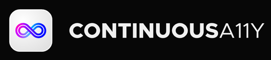

### Watch your website accessibility compliance with Continuous Accessibility*

Continuous Accessibility helps developers maintain high WCAG and ADA compliance in their web applications through automated analysis of pull requests and branches. Continuous Accessibility detects accessibility violations and provides clear remediation guidance to help fix issues.

**Fine-grained feedback, early in development cycle** - analyze your web applications automatically after every commit and get a comprehensive report in your pull request directly.

**Web accessibility monitoring** - track accessibility metrics across your projects: WCAG compliance without manual oversight.

**Integration with CI/CD** - fail pipelines and block deployments when accessibility standards are not met.  It natively integrates with GitHub, Bitbucket, and other VCS platforms, providing detailed feedback on accessibility violations directly in pull requests.

**Developer-focused experience** - learn and implement accessibility best practices with a tool that fits precisely into developers' workflows.

**Requirements:**

- Create your account on [UserWay Continuous Accessibility](https://cicd.qa.userway.dev)
- Import your web application repository to analyze in just a few clicks
- Integrate UserWay accessibility reports generation into your end to end tests. Cypress, Playwright, Selenium and Puppeteer are supported. Read more about [e2e tests integrations](https://docs.cicd.qa.userway.dev/ )

**Usage:**

Project metadata, including the location of the reports to be analyzed, must be declared in the file userway.config.js (or userway.config.ts) in the base directory

    /** @type {import('@userway/cicd-cli').schema.Config} */
    module.exports = { 
        organization:<replace with your Continuous Accessibility organization slug>
        project: <replace with your Continuous Accessibility project name>,
        path: './uw-a11y-reports', // relative path to report directory TODO rename to reportPath
        token: process.env.USERWAY_TOKEN
    };

The workflow, usually declared in .github/workflows/build.yml, looks like:

    on:
      push:
      branches:
      - master
      pull_request:
      types: [opened, synchronize, reopened]
    name: Main Workflow
    jobs:
      userway-cicd:
        runs-on: ubuntu-latest
        steps:
        - uses: actions/checkout@v4

        - name: UserWay Accessibility Analysis       
            uses: UserWayOrg/cicd-analyze@v1.0        
            with:
              command: 'analyze'
              token: ${{ secrets.USERWAY_TOKEN }}

**Secrets:**

*USERWAY_TOKEN* – this is the token used to authenticate access to Continuous Accessibility. You can get a token on your project settings page, then set the USERWAY_TOKEN environment variable in the "Secrets" settings page of your repository.


**Example of pull request analysis:**

Want to see more examples of Continuous Accessibility in action? You can explore Continuous Accessibility [sample project](https://github.com/UserWayOrg/sample-cypress-project-github)
TODO refine

**Have questions or feedback?**

To provide feedback or request assistance please [contact us](https://userway.org/contact)

**License**

The Dockerfile and associated scripts and documentation in this project are released under the LGPLv3 License.
Container images built with this project include third-party materials.
TODO refine